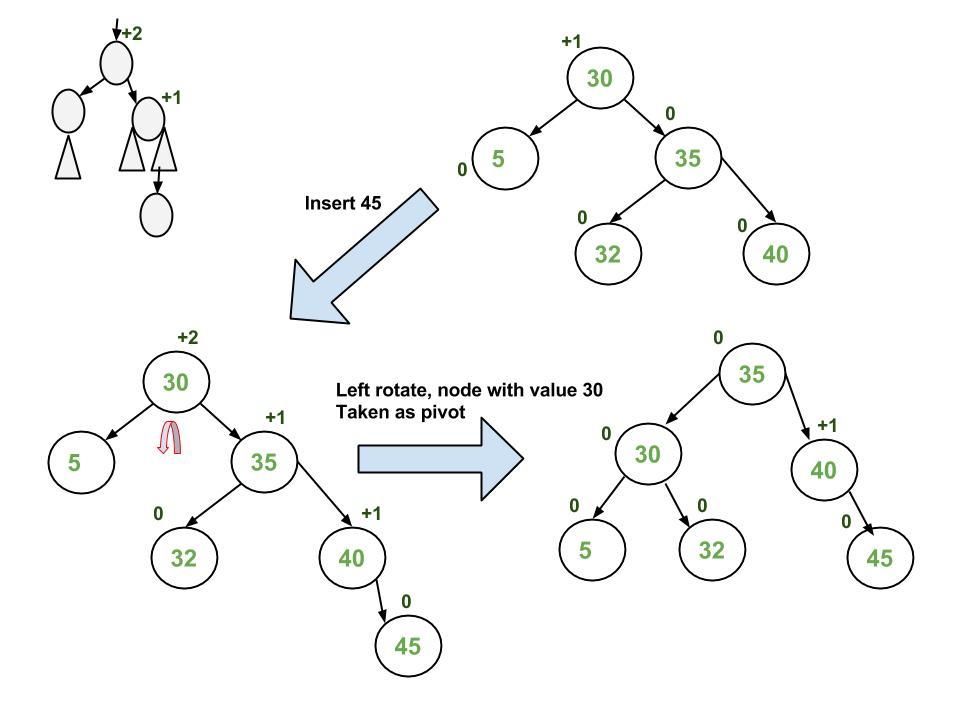

# Trees

Binary search tree: Each node right child is greater than current and left is less than current

Worst case a tree with only right children, devolves into a linked list with O(n) worst case search

Solve problem with balancing the tree

Two main types of balanced trees:

1. AVL Tree
2. Red Black Tree

## AVL Tree

AVL tree guarantees O(log n) lookup by balancing the left and right subtree
of each node based on the balance factor being no more than 1

Balance factor of a node is the length of the right subtree minus the length of the left subtree. (or the difference between the two, no negatives)

If the balance factor of a node becomes more than 1, a rotation is needed to balance

There are 4 rotation situations:
1. right rotation
2. left rotation
3. right-left rotation
4. left-right rotation

For a right rotation, the node below the node with BF of 2 becomes the new root of the subtree

for a right-left rotation, a left rotation followed by a right rotation

